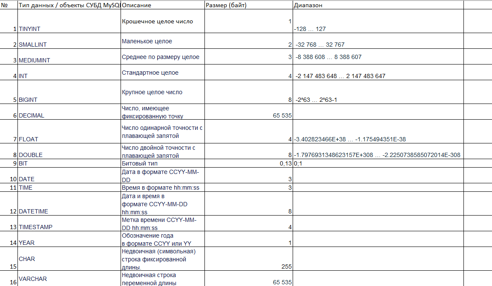
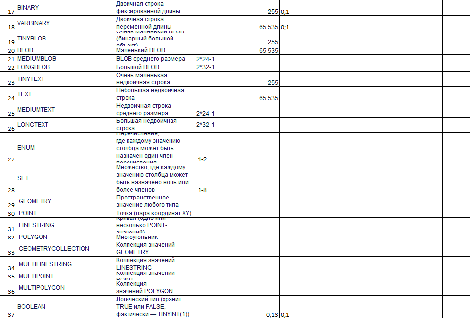
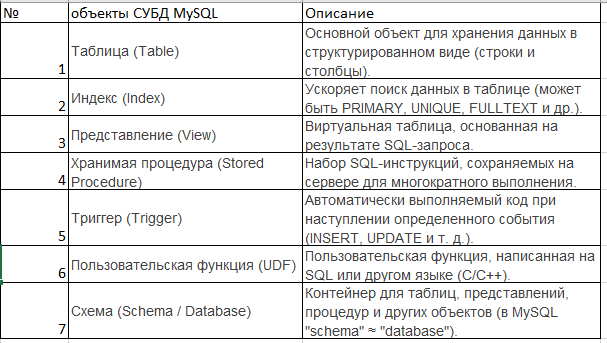
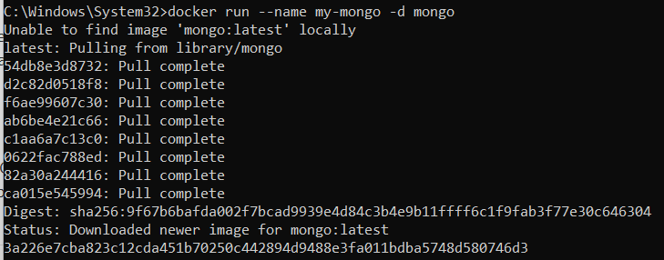
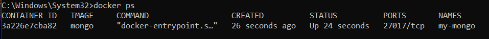
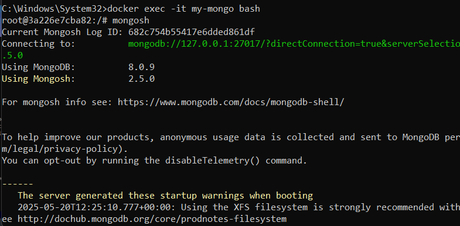
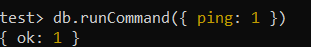
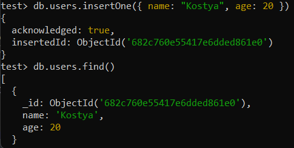

# Отчёт по БД самостоятельная работа 1
## Инвариантная часть

### Задание 1.1 Заполнить таблицу "Типы данных и объекты СУБД MySQL"

[файл Excel](office/SR-1_DB.xlsx)

### Задание 1.2 Создать презентацию на тему «Ведущие производители СУБД»

При выполнении задания следует воспользоваться лекционным материалом, основной и дополнительной литературой. Информацию о ведущих производителях СУБД оформите в виде презентации, укажите название СУБД и кратко дайте ей характеристику.

[файл Powerpoint](office/SR-1_2.pptx)

### Задание 1.3 Создать презентацию на тему «Этапы развития СУБД»

При выполнении задания следует воспользоваться: лекционным материалом, основной и дополнительной литературой. Информацию об этапах развития СУБД оформите в виде презентации, где на слайдах отобразите характеристику этапа и ключевое (ключевые) события, которые на этом этапе произошли.

[файл Powerpoint](office/SR-1_3.pptx)

## Вариантная часть
### Задание 1.4 Развертывание БД Mongo с помощью Docker

Выполните развертывание БД Mongo с использованием командной строки Docker (CLI). Опишите в отчете команду для развертывания и результат, продемонстрируйте какую-то простейшую команду по работе с MongoDb (например, создание/получение коллекций данных из БД) с помощью клиента. Примечание: клиент может быть развернут как с использованием Docker, так и без него.

Docker уже имеет связь с официальным репозиторием и позволяет загружать любые пакеты из него. 

Команда docker вызывает утилиту docker, запускает ее подкоманду для запуска контейнера, опция –name помогает обозначить контейнер так, как вам нужно, а опция -d указывает на образ из репозитория.

Можно проверить список запущенных командой контейнеров.

Можно увидеть сводную информацию о контейнерах и их состоянии с указанием времени создания. В этой установке я не задал прямой порт, поэтому по умолчанию используется 27017.

Подключимся к контейнеру.

Я использую подкоманду exec и опцию unite -it, где i означает интерактивное использование контейнера, а t – сборку с помощью терминала в Docker и на хост-машине. В последней строке после знака t указан идентификатор контейнера. Запускаем в этом окружении mongosh для работы с системой, уже локально.

Можно выполнить проверку подключения.

Создадим коллекцию, добавим документ и сразу проверим.

