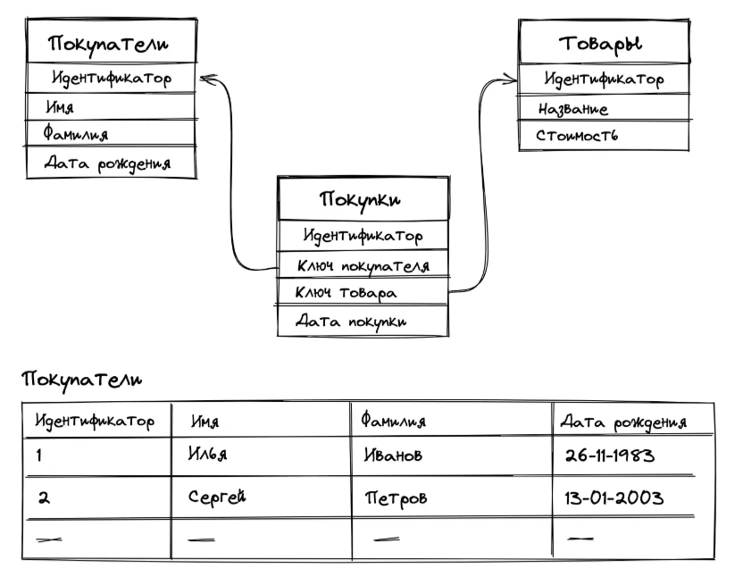
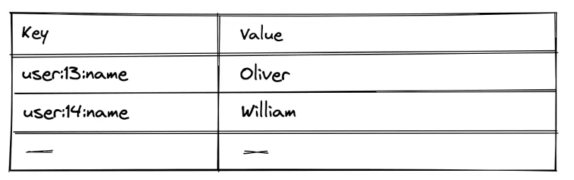
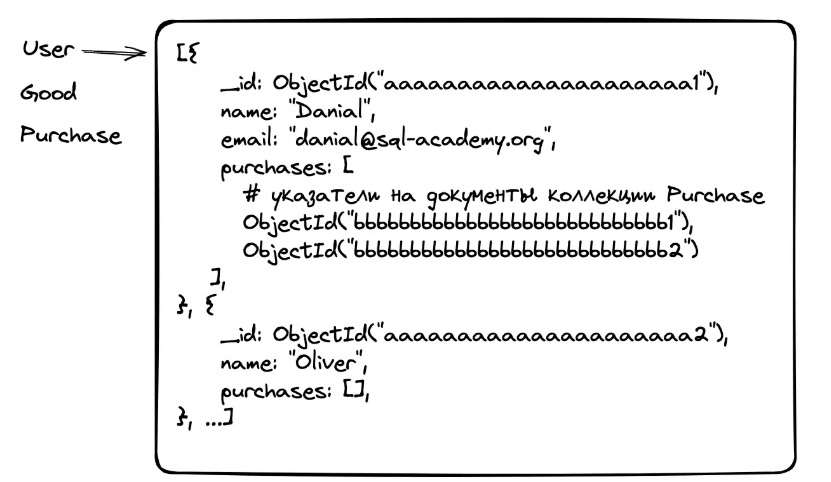
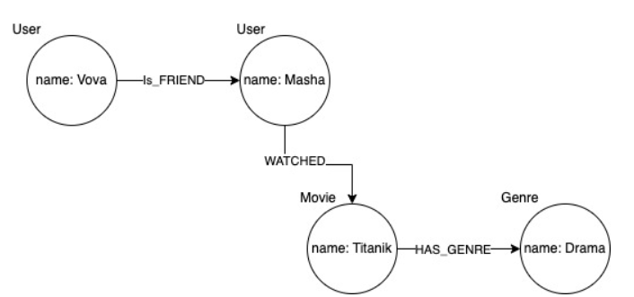
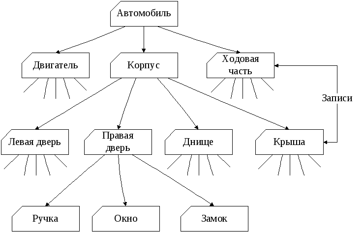
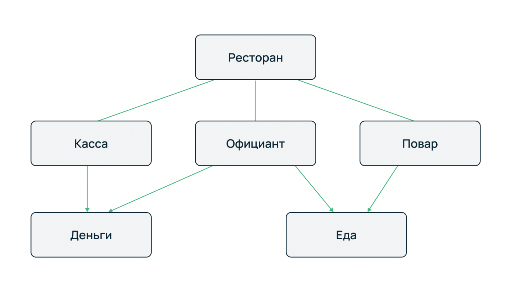
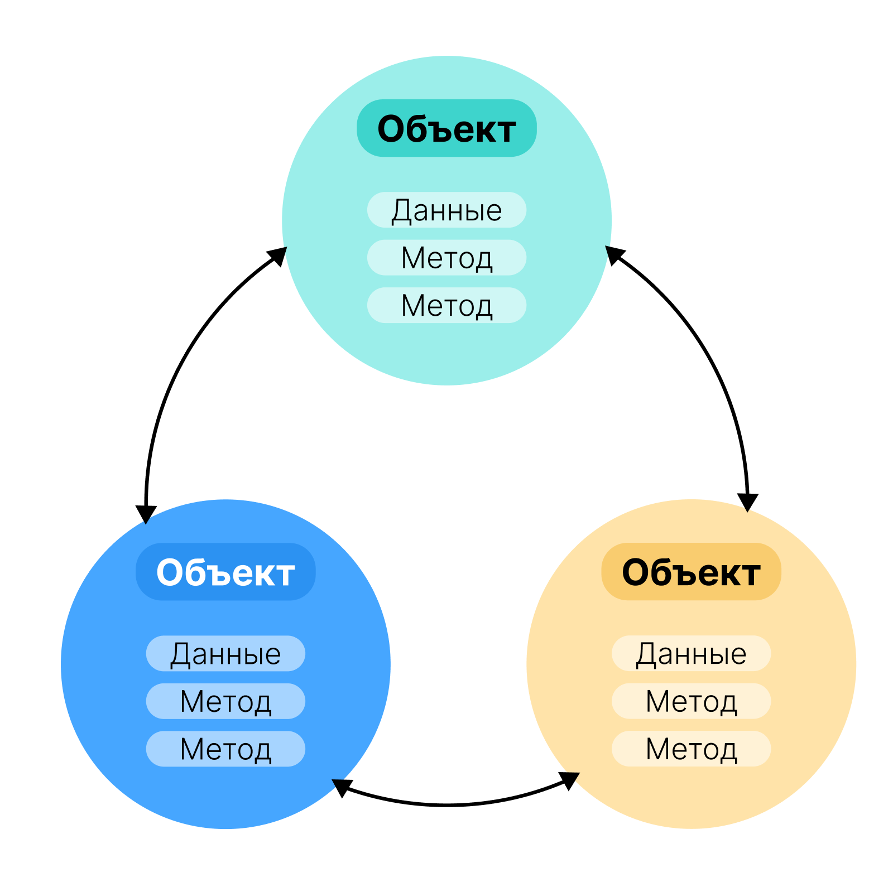
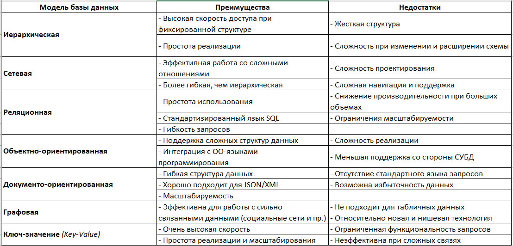

# Отчёт по БД самостоятельная работа 1
## Инвариантная часть

### Задание 2.1: Визуализация примера для моделей и подходов к организации данных

Для каждой модели и подходу к организации данных предложить соответствующую предметную область и описать взаимоотношения ее объектов.

Классификаций баз данных:
- Реляционные базы данных
- Key-value базы данных
- Документоориентированные базы данных
- Графовые базы данных
- Иерархическая база данных
- Сетевая база данных
- Объектно-ориентированная база данных

1. Реляционные базы данных

Данные в реляционных структурах организованы в виде набора таблиц, называемых отношениями, состоящих из столбцов и строк. Каждая строка таблицы представляет собой набор связанных значений, относящихся к одному объекту или сущности. Каждая строка в таблице может быть помечена уникальным идентификатором, называемым первичным ключом, а строки из нескольких таблиц могут быть связаны с помощью внешних ключей.

Пример реляционной базы данных:

2. Key-value базы данных

Key-value базы данных – это тип баз данных, которые хранят данные как совокупность пар «ключ-значение», в которых ключ служит уникальным идентификатором.

Пример key-value базы данных:

3. Документоориентированные БД

В отличие от других баз данных, документоориентированные оперируют «документами», сгруппированными по коллекциям. Документ представляет собой набор атрибутов (ключ и соответствующее ему значение). Значения могут быть как и простыми типами данных (строки, числа или даты), так и более сложными, такими как вложенные объекты, массивы и ссылки на другие документы.

Пример документоориентированные базы данных:

4. Графовые базы данных

Графовые базы данных представляет собой набор объектов, где объекты связаны между собой, подобно как в графе вершины (узлы), связанные через ребра (отношения).

Пример графовой базы данных:

5. Иерархическая база данных

Иерархическая база данных - это сложная многокомпонентная система, в основе которой лежит древовидная структура. Она состоит из комплекса объектов разных уровней (рангов), расположенных по принципу их подчинения от общего к частному.

Пример графовой базы данных:

6. Сетевая база данных

Разница между иерархической моделью данных и сетевой состоит в том, что в иерархических структурах запись-потомок должна иметь в точности одного предка, а в сетевой структуре данных у потомка может иметься любое число предков.

Пример графовой базы данных:

7. Объектно-ориентированная база данных

Объектно-ориентированная база данных - это база данных, в которой данные моделируются в виде объектов, их атрибутов, методов и классов.

Пример графовой базы данных:

## Вариантная часть

### Задание 2.2 Заполните таблицу "Преимущества и недостатки моделей данных"

При выполнении задания следует воспользоваться: лекционным материалом, основной и дополнительной литературой. Информацию о существующих моделях данных и их характеристиках занесите в таблицу.

