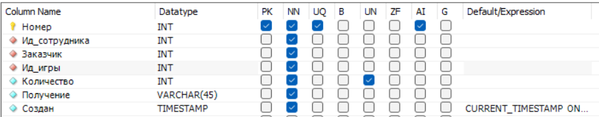
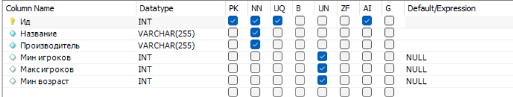
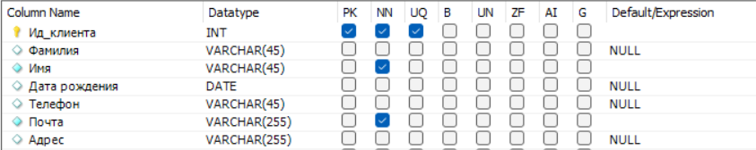
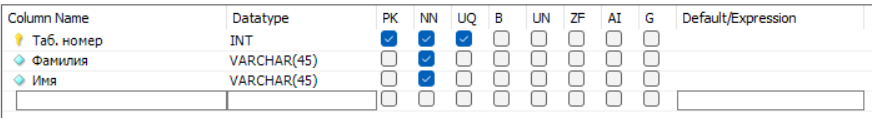
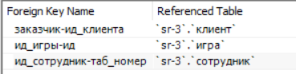

# Отчёт по БД самостоятельная работа 1
## Инвариантная часть

### Задание 3.1: Реализация реляционной модели данных

В предметной области, предложенной преподавателем, реализовать реляционную модель данных. Спроектированная таблица должна отображать связи между сущностями, потенциальные ключи, условия проверки атрибутов.

Откройте документ «Описание ПО», познакомьтесь с предметной областью, которую Вам необходимо представить в виде связанной совокупности
отношений.
Вся дальнейшая работа будет проходить B документе «Начальные отношения». Для удобства предлагается распечатать документ и заполнять его рукописным инструментом.
Задания:
1. Определите потенциальные ключи для каждого из отношений. Если для каких-то отношений таких ключей окажется несколько, выберите один из них на роль первичного (РК), а остальные пометьте альтернативными (АК).

Таблица "заказ":  
- PK-Номер  
- FK-Ид_сотрудника
- FK-Заказчик
- FK-Ид_игры

Таблица "игра":  
- PK-Ид

Таблица "клиент":  
- PK-Ид_клиента  

Таблица "сотрудник":  
- PK-Таб.номер  

2. Определите, какие из атрибутов отношений являются обязательными, т.е. не допускают наличие неизвестных значений. Пометьте такие атрибуты как NOT NULL.
Для атрибутов, входящих в состав первичного ключа данную пометку можно не ставить, т.к. они являются обязательными по определению.

3. Определите условия проверки значений для атрибутов (где возможно и, на ваш взгляд, имеет смысл). Условия требуется записать в виде логического выражения (предиката), в левой части которого указано имя атрибута, а в правой значения, с которыми требуется произвести сравнение. Допускается использование реляционных (>, <, >=, <=, =, !=) и логических (AND, OR) операторов, а также оператора LIKE в том синтаксисе, с которым вы познакомились при выполнении лабораторной работы второй недели.

Проверка на не отрицательное значение происходит с помощью модификатора Unsigned (UN)

4. Определите связи между отношениями.

Связи между отношениями ЗАКАЗ и СОТРУДНИК:
один заказ должен быть обработан ОДНИМ сотрудником
один сотрудник может вести МНОГО заказов

Связи между отношениями ЗАКАЗ и ИГРА:
один заказ может включать МНОГО игр

Связи между отношениями ЗАКАЗ и КЛИЕНТ:
один клиент может делать МНОГО заказов
один заказ выполняется для ОДНОГО клиента

5. Установите связь между отношениями, добавив атрибуты первичного ключа главного отношения (того, к которому относится слово ОДИН) в состав дочернего (того, к которому относится слово МНОГО) и отметив их как внешний ключ (FK).

6. Проверьте добавленные при установке связей атрибуты на обязательность, пометьте их как NOT NULL, если это требуется. Проверьте, не появились ли новые потенциальные ключи в результате добавления новых атрибутов.

Новые ключи не появились

7. Ответьте на вопрос (письменно):
Допустим, что каждый сотрудник может обработать только один заказ (после чего его увольняют ). В этом случае, связь между отношениями ЗАКАЗ и СОТРУДНИК трансформируется в один-к-одному. Что нужно будет сделать дополнительно для поддержки этой связи? Что может помешать указать одного и того же сотрудника в отношении ЗАКАЗ, ответственным за обработку нескольких разных заказов?

Дополнительно надо будет реализовать проверку, если уже заказ у сотрудника.
Помешает то, что после первого заказа сотрудника уволят и он не выполнит второй заказ.

## Вариативная часть

### Задание 3.2: Выделение сущностей и связей

Опираясь на предметную область, предложенной преподавателем, выделить сущности и отобразить связи между ними.

Сущности:

ЗАКАЗ (Номер, Ид_сотрудника, Заказчик, Ид_игры, Количество, Получение, Создан)
ИГРА (Ид, Название, Производитель, Мин игроков, Макс игроков, Мин возраст)
КЛИЕНТ (Ид_клиента, Фамилия, Имя, Дата рождения, Телефон, Почта, Адрес)
СОТРУДНИК (Таб.номер, Фамилия, Имя)

Связи:

СОТРУДНИК-ЗАКАЗ: один-ко-многим
ИГРА-ЗАКАЗ: многие-ко-многим
КЛИЕНТ-ЗАКАЗ: один-ко-многим