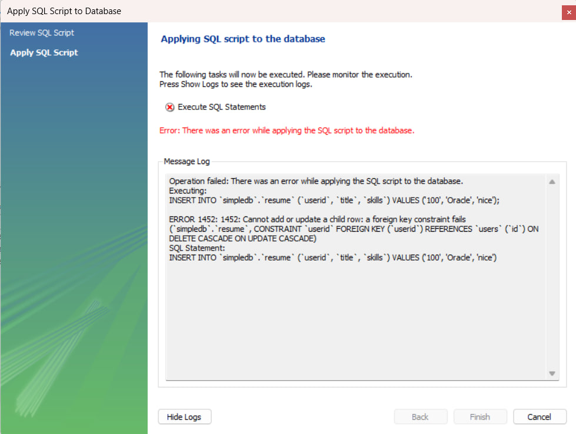
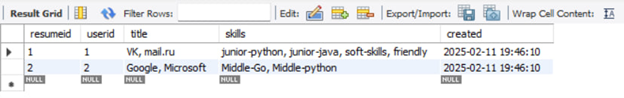
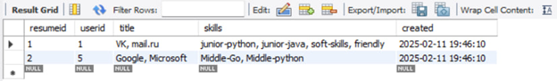

# Отчёт по БД лабораторная 1
## Задание 1

Раздел “Management”: 
1.	Раздел “Server Status”. В разделе отображается общая информация о сервере и подключении к нему. Информация логически сгруппирована. Можно выделить следующие группы:
- Общая информация (например, название хоста, номер порта, версия БД).
- Настройки сервера (например, включен ли брандмауэр, используется ли SSL)
- Каталоги сервера
- Сводка по используемым ресурсам компьютера (ОЗУ, процессор и т. д.)
- Настройки соединения SSL (если SSL включена).
2.	Раздел “Client Connections”. В разделе отображается общая информация о подключениях к серверу. Информация логически сгруппирована. Можно выделить следующие группы:
- Таблица с информацией о клиентах сервера (ID, User, Host, DB, Command, State, Type)
- Возможность скрыть фоновые или спящие процессы.
- Возможность остановить подключение или запрос.
- Информация о подключениях (Количество threads и количество подключений)
3.	Раздел “Users and Privileges”. Позволяет управлять пользователями базы данных и их привилегиями. Информация логически сгруппирована. Можно выделить следующие группы:
- Таблица о пользователях (User, From Host)
- Информация о конкретных пользователях (Login, Account Limits, Administrative Roles, Schema Privileges)
4.	Раздел “Status and System Variables”. В разделе отображается общая информация о статусах и системе. Информация логически сгруппирована. Можно выделить следующие группы:
- Можно выбрать категорию, которую надо рассмотреть (Filtred, Binlog, Comands, Firewall, General)
- Узнать подробную информацию и категории (Name, Value, Descriptions)
5.	Раздел “Data Export”. В разделе отображается общая информация о БД, которое можно экспортировать. Информация логически сгруппирована. Можно выделить следующие группы:
- Информация о возможных БД для экспорта (Folder, Schema)
- Информация о БД, которое экспортируется (Status, Log)
6.	Раздел “Data Import/Restore”. В разделе отображается общая информация о БД, которое можно импортировать. Информация логически сгруппирована. Можно выделить следующие группы:
- Информация о возможных БД для импорта (Folder, Schema)
- Информация о БД, которое импортируется (Status, Log)

Раздел “Instance”
1.	Раздел “Startup / Shutdown”. Позволяет запускать и останавливать экземпляр сервера базы данных. Это полезно для выполнения технического обслуживания или перезагрузки сервера.
2.	Раздел “Server Logs”. Предоставляет доступ к журналам сервера, включая журналы ошибок, общие журналы и журналы медленных запросов. Это помогает в диагностике проблем и анализе производительности.
3.	Раздел “Options File”. Здесь можно просматривать и изменять параметры конфигурации сервера, такие как размер буферов, настройки кэширования, параметры подключения и другие важные параметры, влияющие на работу сервера.

Раздел “Performance”
1.	Раздел “Dashboard”. В разделе отображается общая информация о производительности сервера, о статусе работы SQL server, о InnoDB т его активности.
2.	Раздел “Performance Reports”. В разделе отображается общая информация о использованной памяти, о входных и выходных точках, SQL операторы, схема БД, статистика InnoDB, пользовательские ресурсы.
3.	Раздел “Performance Schema Setup”. В разделе отображается общая информация о производительности системы.

## Задание 3
```
CREATE TABLE `users` (
  `id` int NOT NULL AUTO_INCREMENT,
  `name` varchar(45) NOT NULL,
  `email` varchar(45) NOT NULL,
  PRIMARY KEY (`id`),
  UNIQUE KEY `email_UNIQUE` (`email`)
) ENGINE=InnoDB AUTO_INCREMENT=4 DEFAULT CHARSET=utf8mb3;
```
## Задание 4
```
INSERT INTO `simpledb`.`users` (`name`, `email`) VALUES ('Kostya', 'kostya@mail.ru');
INSERT INTO `simpledb`.`users` (`name`, `email`) VALUES ('Nikita', 'nikita@gmail.com');
INSERT INTO `simpledb`.`users` (`name`, `email`) VALUES ('Nastya', 'nastya@yandex.ru');
```
## Задание 5
```
ALTER TABLE `simpledb`.`users` 
ADD COLUMN `gender` ENUM('M', 'F') NOT NULL AFTER `email`,
ADD COLUMN `bday` DATE NULL AFTER `gender`,
ADD COLUMN `postal_code` VARCHAR(10) NULL AFTER `bday`,
ADD COLUMN `rating` FLOAT NULL AFTER `postal_code`,
ADD COLUMN `created` TIMESTAMP NULL DEFAULT CURRENT_TIMESTAMP() AFTER `rating`,
CHANGE COLUMN `name` `name` VARCHAR(50) NOT NULL ;
ALTER TABLE `simpledb`.`users` ALTER INDEX `email_UNIQUE` VISIBLE;
```
Тип данных у поля created - TIMESTAMP, значение по умолчанию CURRENT_TIMESTAMP(), данное значение возвращает дату и время, когда был создан запрос.
Значение Not Null я выбрал у ID, name, email, gender, чтобы в случае можно было связаться с пользователем и знать, как к нему обращаться.
## Задача 7
```
INSERT INTO `` (`id`,`name`,`email`,`gender`,`bday`,`postal_code`,`rating`,`created`) VALUES (1,'Kostya','kostya@mail.ru','M','2004-12-02','423786',1,'2025-02-11 13:46:50');
INSERT INTO `` (`id`,`name`,`email`,`gender`,`bday`,`postal_code`,`rating`,`created`) VALUES (2,'Nikita','nikita@gmail.com','M','2003-04-28','123890',1.1,'2025-02-11 13:46:50');
INSERT INTO `` (`id`,`name`,`email`,`gender`,`bday`,`postal_code`,`rating`,`created`) VALUES (3,'Nastya','nastya@yandex.ru','F','2007-10-15','456123',1.12,'2025-02-11 13:46:50');
```
## Задание 8
```
CREATE TABLE `resume` (
  `resumeid` int NOT NULL AUTO_INCREMENT,
  `userid` int NOT NULL,
  `title` varchar(100) NOT NULL,
  `skills` text,
  `created` timestamp NULL DEFAULT CURRENT_TIMESTAMP,
  PRIMARY KEY (`resumeid`),
  KEY `userid_idx` (`userid`),
  CONSTRAINT `userid` FOREIGN KEY (`userid`) REFERENCES `users` (`id`) ON DELETE CASCADE ON UPDATE CASCADE
) ENGINE=InnoDB DEFAULT CHARSET=utf8mb3;
```
## Задание 9
```
INSERT INTO `` (`resumeid`,`userid`,`title`,`skills`,`created`) VALUES (1,1,'VK, mail.ru','junior-python, junior-java, soft-skills, friendly','2025-02-11 19:46:10');
INSERT INTO `` (`resumeid`,`userid`,`title`,`skills`,`created`) VALUES (2,2,'Google, Microsoft','Middle-Go, Middle-python','2025-02-11 19:46:10');
INSERT INTO `` (`resumeid`,`userid`,`title`,`skills`,`created`) VALUES (3,3,'Yandex, Avito','Midddle-C++, junior-python','2025-02-11 19:46:10');
```
Не существующий ID нельзя вписать, будет ошибка.


## Задача 10
При удаление из users она удалит запись и из resume.
```
DELETE FROM `simpledb`.`users` WHERE (`id` = '3');
```


При обнавлении значения id в таблице users, обновится и значение userid в таблице resume
```
UPDATE `simpledb`.`users` SET `id` = '5' WHERE (`id` = '2');
```
