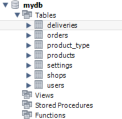

# Отчёт по БД лабораторная 2
## Задание 1

Повторите действия, демонстрируемые в ролике и создайте диаграмму (модель), созданную во второй половине ролика. Экспортируйте модель в виде изображения, экспортируйте модель в виде SQL-скрипта. 

В отчете требуется отобразить:
- схему в виде изображения;
- скопированный запрос, соответствующий созданию этой базы данных, вставьте его в какой-либо сервис для хранения фрагментов кода (gist), сгенерируйте публичную ссылку и вставьте её в отчёт;
- фрагмент запроса, касающийся создания и настройки таблицы invoice.

Изображение диаграммы:


[Ссылка на gist](https://gist.github.com/ZabivakaXD/f14d3e90d6f3ae34ce25fdb5f245eaee)

Создание таблицы invoice:
```
CREATE TABLE IF NOT EXISTS `firstModel`.`invoice` (
  `idinvoice` INT NOT NULL AUTO_INCREMENT,
  `userid` INT NOT NULL,
  `productsid` INT NOT NULL,
  `cost` DECIMAL(10,2) NOT NULL,
  PRIMARY KEY (`idinvoice`),
  UNIQUE INDEX `idinvoice_UNIQUE` (`idinvoice` ASC) VISIBLE,
  INDEX `key_userid_id_idx` (`userid` ASC) VISIBLE,
  INDEX `key_productsid_idproducts_idx` (`productsid` ASC) VISIBLE,
  CONSTRAINT `key_userid_id`
    FOREIGN KEY (`userid`)
    REFERENCES `firstModel`.`users` (`id`)
    ON DELETE CASCADE
    ON UPDATE CASCADE,
  CONSTRAINT `key_productsid_idproducts`
    FOREIGN KEY (`productsid`)
    REFERENCES `firstModel`.`products` (`idproducts`)
    ON DELETE CASCADE
    ON UPDATE CASCADE)
ENGINE = InnoDB;
```

## Задание 2

Создайте собственную EER-диаграмму и спроектируйте БД с параметрами на основе текста, опубликованного по ссылке: [https://habr.com/ru/post/175985/](https://habr.com/ru/post/175985/)

Экспортируйте полученную модель в виде изображения, экспортируйте модель в виде SQL-скрипта.
В отчете требуется отобразить: 
- схему в виде изображения;
- скопированный запрос, соответствующий созданию этой базы данных, вставьте его в какой-либо сервис для хранения фрагментов кода (gist, Codepen), сгенерируйте публичную или секретную ссылку и вставьте её в отчёт;
- фрагмент запроса, касающийся создания и настройки таблицы Orders.

Изображение диаграммы:


[Ссылка на gist](https://gist.github.com/ZabivakaXD/823e07352fbf8ada23cdcae53b24d38f)

Создание таблицы Orders:
```
CREATE TABLE IF NOT EXISTS `mydb`.`orders` (
  `id` INT NOT NULL AUTO_INCREMENT,
  `shop_id` INT NOT NULL,
  `product_id` INT NOT NULL,
  `fio` INT NOT NULL,
  `date` DATE NULL,
  `quantity` TINYINT NULL,
  `tel` VARCHAR(100) NULL,
  `confirm` TINYINT(1) NULL,
  PRIMARY KEY (`id`, `shop_id`, `product_id`, `fio`),
  UNIQUE INDEX `id_UNIQUE` (`id` ASC) VISIBLE,
  INDEX `orders_to_shops_idx` (`shop_id` ASC) VISIBLE,
  INDEX `orders_to_products_idx` (`product_id` ASC) VISIBLE,
  INDEX `fio_to_users_idx` (`fio` ASC) VISIBLE,
  CONSTRAINT `orders_to_shops`
    FOREIGN KEY (`shop_id`)
    REFERENCES `mydb`.`shops` (`id`)
    ON DELETE CASCADE
    ON UPDATE CASCADE,
  CONSTRAINT `orders_to_products`
    FOREIGN KEY (`product_id`)
    REFERENCES `mydb`.`products` (`id`)
    ON DELETE CASCADE
    ON UPDATE CASCADE,
  CONSTRAINT `fio_to_users`
    FOREIGN KEY (`fio`)
    REFERENCES `mydb`.`users` (`id`)
    ON DELETE CASCADE
    ON UPDATE CASCADE)
ENGINE = InnoDB;
```

## Задание 3

Выполните операцию Database - Forward Engineer и создайте базу данных на вашем сервере. Сделайте скриншот с успешным выполнением этого процесса и вставьте его в отчет. 

Изображение БД с диаграммой:


## Задание 4

Добавьте несколько строк и новых атрибутов в каждую таблицу созданной базы данных. Попробуйте удалить связанные в нескольких таблицах данные, зафиксируйте, что произошло и опишите текстом (и по возможности дополните скриншотами) в отчёте.

При удалении строки из таблицы Orders удалится строка и из Deliveres, потому что там есть ordersid, которого больше не сущетсвует.

