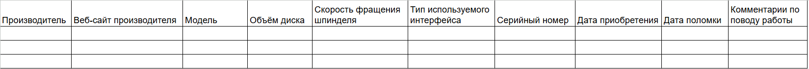

# Отчёт по БД лабораторная 5

Задание: Требуется, основываясь на описании предметной области,
спроектировать базу данных, все отношения в которой нормализованы до
НФБК. 

Предметная область: учет накопителей на жестких дисках (HDD),
используемых в организации. О дисках мы знаем следующее:
- у жесткого диска есть производитель;
- у производителя есть web-сайт (считаем, что только один), где можно
почерпнуть много важной для нас информации;
- для жесткого диска всегда определена его модель;
- модель определяет объем диска (в гигабайтах), скорость вращения
шпинделя, тип используемого интерфейса;
- по названию модели можно определить производителя;
- у конкретного экземпляра жесткого диска есть серийный номер, мы
знаем его модель, дату приобретения, дату выхода из строя (если диск
вышел из строя; возможность ремонта и восстановления не рассматриваем);
может возникнуть необходимость внести текстовые комментарии по поводу
его работы.

При проектировании надо учитывать, что:
- для любой модели обязательно должен быть указан производитель и
объем;
- для любого диска должна быть указана модель;
- фирмы-производители и модели дисков именуются уникальным
образом; серийные номера дисков также уникальны.

Шаги выполнения:
1. Постройте ОДНО отношение, которое включает ВСЕ атрибуты,
которые заявлены в предметной области.
2. Приведите отношение до 3НФ. Произведите декомпозицию в
соответствии с требованиями.
3. Найдите первичные ключи каждого полученного отношения на этапе
3НФ.
4. Рассмотрите функциональные зависимости полученных конечных
отношений. Если все зависимости отвечают требования НФБК –
работа закончена.

Напоминание требований НФБК:
- детерминант ФЗ является потенциальным (первичным ключом).
- естественное соединение полученных проекций должно дать
исходное отношение. 

## Задание 1
Приведена таблица со всеми нужными столбцами информации:

## Задание 2
Производим декомпозицию на 3 разных таблицы:
Таблица Производитель диска:

Таблица Модель диска:

Таблица Жёсткий диск:

После создания общей таблицы, отображающих понятия предметной
области. По модели предметной области выписываются
обнаруженные функциональные зависимости. Все отношения
автоматически находятся в 1НФ. 

Убираем зависимость атрибутов от части сложного ключа и
проводим декомпозицию этих отношений на несколько
отношений следующим образом: те атрибуты, которые зависят от
части сложного ключа выносятся в отдельное отношение вместе с
этой частью ключа. После этого отношения находятся в 2НФ.

Убираем зависимость некоторых неключевых атрибутов от
других неключевых атрибутов и проводим декомпозицию этих
отношений следующим образом: те неключевые атрибуты,
которые зависят от других неключевых атрибутов выносятся в
отдельное отношение. После этого отношения находятся в 3НФ.

## Задание 3

Таблица Производитель диска: Производитель (PK)

Таблица Модель диска: Модель (PK) 

Таблица Жёсткий диск: Серийный номер (PK) 

(PK - primary key) 

## Задание 4

Производитель -> Веб-сайт производителя

Модель -> Производитель, Объём диска, Скорость фращения шпинделя, Тип используемого интерфейса

Серийный номер -> Модель, Дата приобретения, Дата поломки, Комментарии по поводу работы

Детерминанты являются первичными ключами, что соответствует НФКБ.
Также естественное соединение трёх таблиц даёт исходное отношение первой таблицы без потерь информации. Всё удовлетворяет НФКБ.