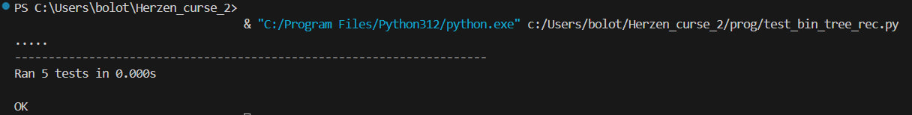
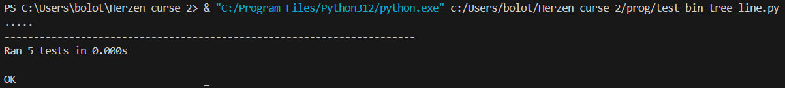

# Лабораторная работа №1

## Задание 1

Разработайте программу на языке Python, которая будет строить бинарное дерево (дерево, в каждом узле которого может быть только два потомка). Отображение результата в виде словаря (как базовый вариант решения задания). Далее исследовать другие структуры, в том числе доступные в модуле collections в качестве контейнеров для хранения структуры бинарного дерева. 

Необходимо реализовать рекурсивный и нерекурсивный вариант gen_bin_tree

Алгоритм построения дерева должен учитывать параметры, переданные в качестве аргументов функции. Пример: 
```
def gen_bin_tree(height=<number>, root=<number>):
    pass
```

Если параметры были переданы, то используются они. В противном случае используются параметры, указанные в варианте.

Дерево должно обладать следующими свойствами:

В корне дерева (root) находится число, которое задает пользователь (индивидуально для студента).
Высота дерева (height) задается пользователем (индивидуально для студента).
Левый (left leaf) и правый потомок (right leaf) вычисляется с использованием алгоритмов, индивидуальных для каждого студента в группе и приведен ниже.

Функция gen_bin_tree_rec(height, root):
   - Строит двоичое дерево рекурсивным способом.
   - Принимает высоту дерева и значение корня.
   - Возвращает двоичное дерево в виде вложенных словарей.
   - Ловит ошибки в случае неправильнного ввода данных.

```
MAX_REC_HEIGHT = 995
MIN_REC_HEIGHT = 0

def gen_bin_tree_rec(height: int, root: int, left_leaf = lambda x: x * 2, right_leaf = lambda x: x + 3):
    if type(height) is not int or type(root) is not int:
        raise BinaryTreeArgumentException()
    elif height > MAX_REC_HEIGHT or height < MIN_REC_HEIGHT:
        raise BinaryTreeRecursionException()
    elif height == 0:
        return {root:[]}
    else:
        feed = {}
        left_leaf = root * 2
        right_leaf = root + 3
        
        if height != 1:
            left_branch = gen_bin_tree_rec(height - 1, left_leaf)
            right_branch = gen_bin_tree_rec(height - 1, right_leaf)
        if height == 1:
            feed[root] = [left_leaf, right_leaf]
        else:
            feed[root] = [left_branch, right_branch]

    return feed
```
Данная программа прошла все тесты:



Функция gen_bin_tree_line(height, root):
   - Строит двоичое дерево линейным способом.
   - Принимает высоту дерева и значение корня.
   - Возвращает двоичное дерево в виде вложенных словарей.
   - Ловит ошибки в случае неправильнного ввода данных.

```
MAX_LINE_HEIGHT = 31
MIN_LINE_HEIGHT = 0

def gen_bin_tree_line(height: int, root: int, left_leaf = lambda x: x * 2, right_leaf = lambda x: x + 3):
    if type(height) is not int or type(root) is not int:
        raise BinaryTreeArgumentException()
    elif height > MAX_LINE_HEIGHT:
        raise BinaryTreeMemoryException()
    elif height < MIN_LINE_HEIGHT:
        raise BinaryTreeIndexException()
    elif height == 0:
        return {root : []}
    else:
        numbers = [0] * (2**(height + 1) - 1)
        count = 0
        numbers[count] = root
        
        while count * 2 + 1 <= len(numbers) - 1:  
            numbers[count * 2 + 1] = numbers[count] * 2 
            if count * 2 + 2 <= len(numbers) - 1:  
                numbers[count * 2 + 2] = numbers[count] + 3
            count += 1
            
        for height_local in range (height, 0, -1):
            lvl_down = numbers[2**height_local - 1:len(numbers)]
            lvl_up = numbers[2**(height_local - 1) - 1:len(numbers) - 2**height_local]
            numbers.reverse()
            del numbers[0:2**height_local + 2**(height_local - 1)]
            numbers.reverse()
            count = 0
            while count < len(lvl_up):
                numbers.append({lvl_up[count] : [lvl_down[count * 2], lvl_down[count * 2 + 1]]})
                count += 1
            
    return numbers[0]
```
Данная программа прошла все тесты:



[Ссылка на файл](https://github.com/ZabivakaXD/Herzen_curse_2/blob/main/prog/bin_tree.py)