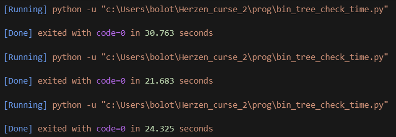
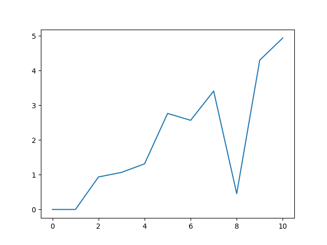
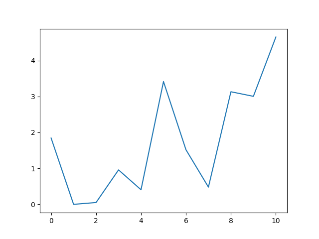
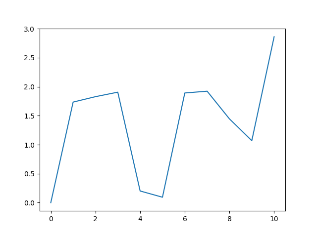
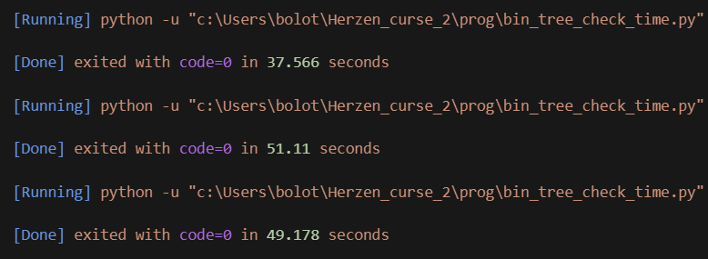
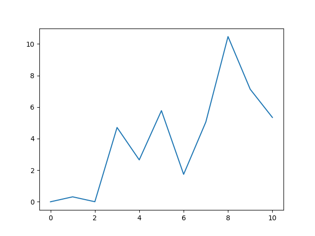
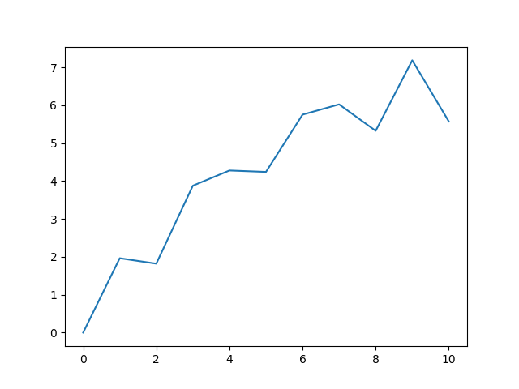
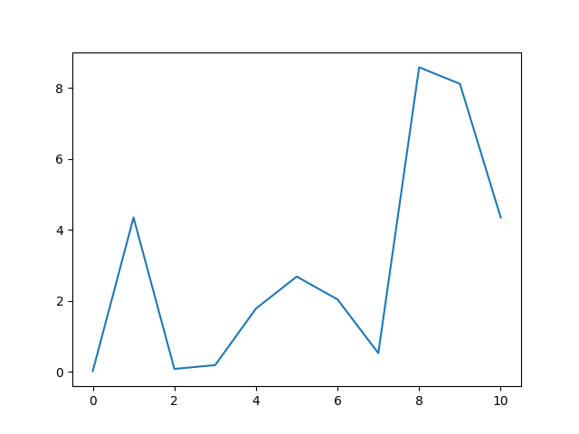

# Лабораторная работа №2

## Задание 1

С использованием борда [https://replit.com/@zhukov/prog-4-lr2-1#main.py](https://replit.com/@zhukov/prog-4-lr2-1#main.py) сравнить реализации (рекурсивной и нерекурсивной) построения бинарного дерева с точки зрения эффективности работы алгоритма (время выполнения) двумя способами: 
"timeit" с помощью модуля timeit;
"complex-profiling" с помощью создания специальной оболочки для тестирования (matplotlib, setup_data, timeit).

Для второго способа следует переписать содержимое функции setup_data так, чтобы генерировались не списки чисел (в борде пример генерации данных для сравнения работы функции-факториала), а списки пар чисел (кортеж или словарь, представляющих root и height), также необходимо определить оптимальные значения параметров: количество «прогонов» тестов и длина списка с параметрами для построения деревьев.

## Решение

```
from exception_bin_tree import *

MAX_REC_HEIGHT = 995
MIN_REC_HEIGHT = 0
MAX_LINE_HEIGHT = 31
MIN_LINE_HEIGHT = 0

def setup_data(n):
    from random import randint
    min_height = 0
    max_height = 20
    data = [None] * n 
    for i in range(n):
        data[i] = randint(min_height, max_height)
    # example [0, 19, 20, 3, 100, 45, 34, 97, 8, 38]
    return data

def calculate_time(n, func):
    import timeit
    data = setup_data(n)
    delta = 0
    for n in data:
        start_time = timeit.default_timer()
        func(n,1)
        delta += timeit.default_timer() - start_time

    return delta

def gen_bin_tree_rec(height: int, root: int, left_leaf = lambda x: x * 2, right_leaf = lambda x: x + 3):
    if type(height) is not int or type(root) is not int:
        raise BinaryTreeArgumentException()
    elif height > MAX_REC_HEIGHT or height < MIN_REC_HEIGHT:
        raise BinaryTreeRecursionException()
    elif height == 0:
        return {root:[]}
    else:
        feed = {}
        left_leaf = root * 2
        right_leaf = root + 3
        
        if height != 1:
            left_branch = gen_bin_tree_rec(height - 1, left_leaf)
            right_branch = gen_bin_tree_rec(height - 1, right_leaf)
        if height == 1:
            feed[root] = [left_leaf, right_leaf]
        else:
            feed[root] = [left_branch, right_branch]

    return feed

def gen_bin_tree_line(height: int, root: int, left_leaf = lambda x: x * 2, right_leaf = lambda x: x + 3):
    if type(height) is not int or type(root) is not int:
        raise BinaryTreeArgumentException()
    elif height > MAX_LINE_HEIGHT:
        raise BinaryTreeMemoryException()
    elif height < MIN_LINE_HEIGHT:
        raise BinaryTreeIndexException()
    elif height == 0:
        return {root : []}
    else:
        numbers = [0] * (2**(height + 1) - 1)
        count = 0
        numbers[count] = root
        
        while count * 2 + 1 <= len(numbers) - 1:  
            numbers[count * 2 + 1] = numbers[count] * 2 
            if count * 2 + 2 <= len(numbers) - 1:  
                numbers[count * 2 + 2] = numbers[count] + 3
            count += 1
            
        for height_local in range (height, 0, -1):
            lvl_down = numbers[2**height_local - 1:len(numbers)]
            lvl_up = numbers[2**(height_local - 1) - 1:len(numbers) - 2**height_local]
            numbers.reverse()
            del numbers[0:2**height_local + 2**(height_local - 1)]
            numbers.reverse()
            count = 0
            while count < len(lvl_up):
                numbers.append({lvl_up[count] : [lvl_down[count * 2], lvl_down[count * 2 + 1]]})
                count += 1
            
    return numbers[0]
    
def main():
    import matplotlib.pyplot as plt
    res = []
    for n in range(1, 22, 2):
        res.append(calculate_time(n, gen_bin_tree_rec))
    plt.plot(res)
    plt.show()
    
if __name__ == '__main__':
    main()
```

Функция setup_data(n):
   - Заполняет массив длинны n случайными числами от min_height до max_height и возвращает его.
```
def setup_data(n):
    from random import randint
    min_height = 0
    max_height = 20
    data = [None] * n 
    for i in range(n):
        data[i] = randint(min_height, max_height)
    # example [0, 19, 20, 3, 100, 45, 34, 97, 8, 38]
    return data
```

Функция calculate_time(n, func):
   - Запускает функцию n раз с данными из setup_data(n) записывает время перед началом итерации и после итерации, чтобы узнать время её выполнения и узнать сколько в итоге будут выполняться все данные.
```
def calculate_time(n, func):
    import timeit
    data = setup_data(n)
    delta = 0
    for n in data:
        start_time = timeit.default_timer()
        func(n,1)
        delta += timeit.default_timer() - start_time

    return delta
```

Функция main():
   - Запускает функцию n раз количеством запусков (всего n будет иметь 10 значений от 1 до 21 с шагом 2) а потом строит рисунок по полученному времени.
```
def main():
    import matplotlib.pyplot as plt
    res = []
    for n in range(1, 22, 2):
        res.append(calculate_time(n, gen_bin_tree_rec))
    plt.plot(res)
    plt.show()
```

Остальная часть кода, взята из прошлой лабораторной работы и просто представляет построение бинарного дерева двумя способами, [прошлая лабораторная работа](https://github.com/ZabivakaXD/Herzen_curse_2/blob/main/prog/lab-1_sem-4.md).

Сравнение времени с помощью с помощью модуля timeit. Как видно рекурсивный способ выполняется быстрее.


Сравнеие с помощью создания специальной оболочки для тестирования (matplotlib, setup_data, timeit).
Эти сравнения у меня получились не постоянные, так как время постоянно разное и при увелечение количества повторений время не всегда увеличивается. Но можно сделать вывод, что не рекурсивная быстрее.
Для не рекурсивного способа получилось:





Для не рекурсивного способа получилось:



