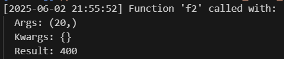
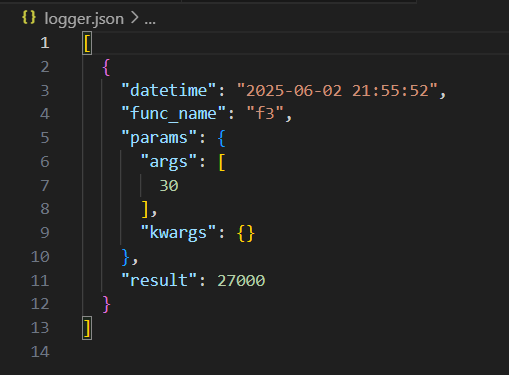
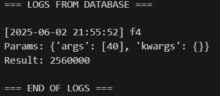

# Лабораторная работа №3

## Задание:

Реализовать параметризованный декоратор, который:
1) По умолчанию пишет в консоль (sys.stdout)

2) Может писать в текстовый файл в формате json (если передано имя файла '*.json') со следующей структурой одной записи:
дата-время вызова функции, какая функция была вызвана и с какими параметрами и с каким результатом завершена.
```
[{'datetime': '', 'func_name': 'str()',  'params': ['1','2', '3', ...], 'result': '...' }]
```

3) Может писать в базу данных sqlite3 (если передан объект типа sqlite3.Connection), развернутая в памяти компьютера. Не забыть предварительно создать таблицу для лога: 
```
cur = con.execute("INSERT INTO logtable VALUES (1234566, 'foo', '2', '4')") 
```
и записать в нее логи, также "Рядом" с декоратором должна быть утилита, которая отображает содержимое базы данных с логированными данными

[Решение](https://github.com/ZabivakaXD/Herzen_curse_2/blob/main/prog/decorator_sem-4.py)

1) 


2) 


3) 

