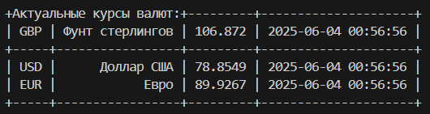

# Лабораторная работа №3

## Цель задания
Разработать приложение для получения курсов валют с сайта Центробанка России, используя объектно-ориентированный подход и архитектурный паттерн MVC (Model-View-Controller).

### Требования к функционалу
1. Компонент Model:

* Представляет собой класс CurrencyRates, который отправляет запросы к сайту ЦБ РФ.
* На вход принимает список отслеживаемых валют (строки длины три, например, ["USD", "EUR", "GBP"]).
* Реализует паттерн "Одиночка" (Singleton), чтобы в приложении существовал только один объект данного класса.
* Использует геттер для получения текущих курсов валют.
* Использует сеттер для обновления списка отслеживаемых валют.

2. Компонент View:

* Использует шаблонизатор Jinja2 или какую-либо другую библиотеку (пример) для отображения данных.
* Позволяет пользователю просматривать курсы валют в удобном формате.

3. Компонент Controller:

* Обрабатывает запросы и управляет логикой приложения.
* Сохраняет полученные данные в базу данных SQLite3 (реализован именованный стиль для параметризации запросов в БД).
* Передаёт данные в представление для отображения.

### Дополнительные требования

* Данные должны загружаться с официального API или XML-файла Центробанка России.
* Для взаимодействия с API можно использовать библиотеку requests.
* Использование библиотек sqlite3 для работы с базой данных и jinja2 для шаблонов.

### Этапы выполнения

* Реализовать класс CurrencyRates (паттерн "Одиночка").
* Реализовать контроллер для обработки запросов и сохранения данных в SQLite3.
* Разработать шаблоны на Jinja2 для отображения информации.
* Написать код для интеграции всех компонентов в MVC-структуре.
* Протестировать приложение, проверив работу с разными валютами.

### Критерии оценки

* Корректная работа паттерна "Одиночка".
* Грамотная реализация модели, представления и контроллера.
* Работа с API Центробанка и корректное извлечение данных.
* Корректное сохранение данных в SQLite3.
* Использование Jinja2 или альтернативного способа формирования View.
* Читабельность и структурированность кода.

## [Решение](https://github.com/ZabivakaXD/Herzen_curse_2/blob/main/prog/lab-4)

