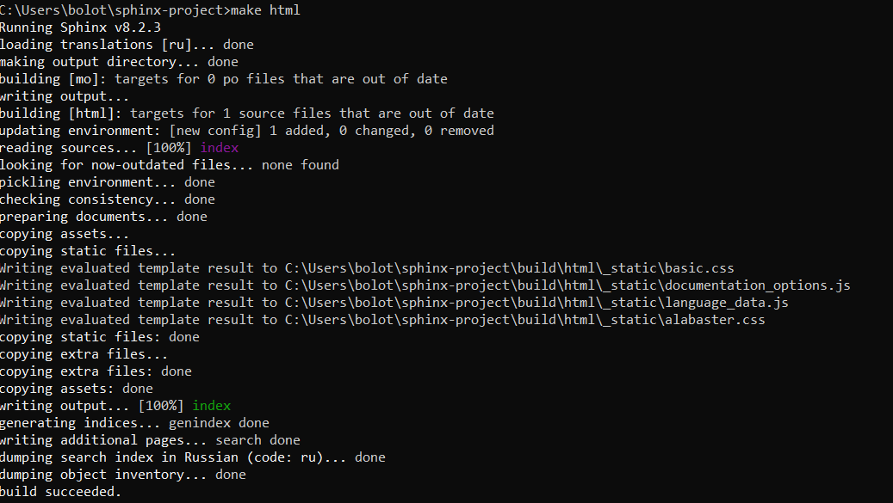

# Лабораторная работа №7

На основе материалов темы реализовать развертывание проекта на Sphinx и продемонстрировать это развертывание и его результат в отчете. 

- Отчет может быть выполнен либо в виде:
- README.md файла борда replit;
- текстового файла docx / pdf, приложенного к отчету, 
- в виде скринкаста, выгруженного в облачное хранилище / RuTube / VK Видео, ссылка предоставляется в качестве ответа на задание.

1. Первым шагом необходимо установить Sphinx и дополнительные зависимости:

2. Инициализируем новый проект Sphinx:

3. Редактируем файл source/conf.py:

4. Редактируем файл source/index.rst:

5. Собираем проект:

6. Запускаем проект:

7. Результат:

